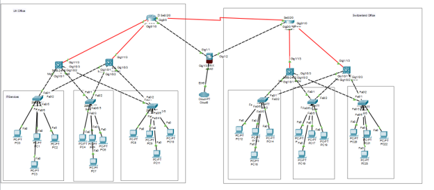
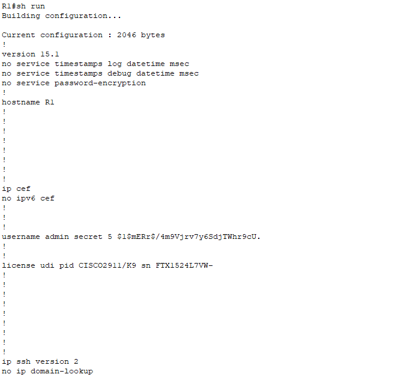
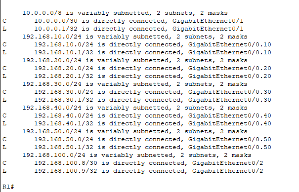
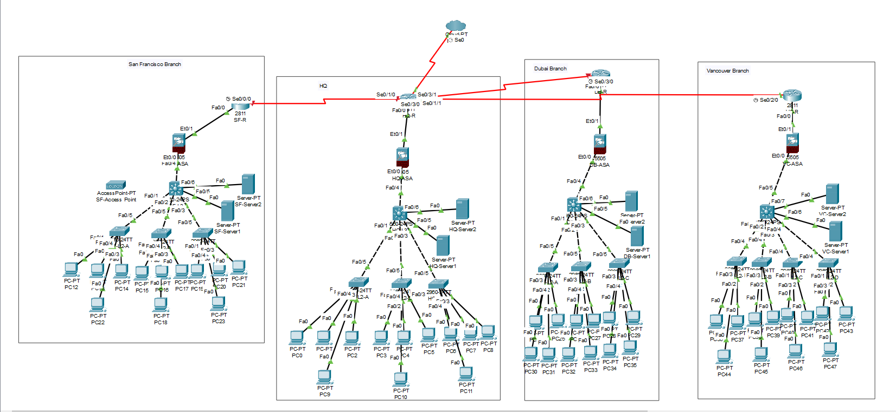
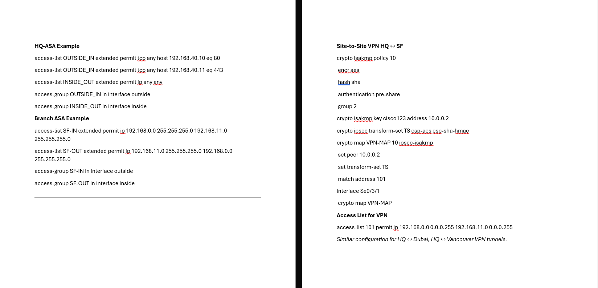

# Secure Enterprise Network Design — Multi-Site, Data Center & VPN Architecture

Enterprise network architecture portfolio covering **VLAN segmentation, IPv4 subnetting, Layer 3 switching, static routing, OSPF, ACLs, Cisco ASA firewalls, NAT/PAT, SSH, DMZ design, and site-to-site IPsec VPN connectivity**.

This repository consolidates three related Cisco network-design projects into a structured technical portfolio:

1. **UK ↔ Switzerland Multi-Site Enterprise Network**
2. **Secure Data Center Network Redesign**
3. **Global Enterprise Network — HQ + San Francisco + Dubai + Vancouver**

> **Portfolio approach:** The three designs are preserved as separate case studies. They use different addressing schemes, routing approaches, and security requirements and should not be interpreted as one production network.

---

## Project Overview

Modern enterprise networks must provide more than basic connectivity.

A secure network architecture needs to address:

- Departmental segmentation
- IP addressing and subnetting
- Inter-VLAN communication
- WAN routing
- Access-control policy
- Server isolation
- Perimeter security
- Secure administration
- Public-service exposure
- Multi-site connectivity
- Troubleshooting and validation
- Future scalability

These case studies explore those requirements through progressively broader Cisco network designs.

The progression is:

```text
Multi-Site Enterprise Network
          │
          ▼
Secure Data Center Redesign
          │
          ▼
Global Secure Enterprise Architecture
```

The portfolio includes both **original configuration evidence** and **technical review of the original designs**, including configuration inconsistencies and opportunities for modernisation.

---

# Architecture Progression

| Capability | Case Study 1 | Case Study 2 | Case Study 3 |
| --- | :---: | :---: | :---: |
| Hierarchical architecture | ✓ | ✓ | ✓ |
| VLAN segmentation | ✓ | ✓ | ✓ |
| IPv4 subnetting | ✓ | ✓ | ✓ |
| DHCP | ✓ | ✓ | ✓ |
| Inter-VLAN routing | ✓ | ✓ | ✓ |
| Static routing | ✓ | ✓ | ✓ |
| OSPF | Config preserved | Future enhancement | Limited documented example |
| ACLs | Design context | ✓ | ✓ |
| Cisco ASA | Design context | ✓ | ✓ |
| NAT/PAT | Design context | ✓ | ✓ |
| SSH management | — | ✓ | Security context |
| Server segmentation | Limited | ✓ | ✓ |
| Management VLAN | — | ✓ | Architecture context |
| DMZ | — | Server zone | ✓ |
| Site-to-site IPsec | Requirement/context | — | ✓ |
| International branches | 2 sites | — | HQ + 3 branches |

---

# Case Study 1 — UK & Switzerland Multi-Site Enterprise Network

## Scenario

The first network connects enterprise operations in:

```text
United Kingdom
      │
      │ WAN
      │
Switzerland
```

Each location contains several departmental networks connected through a hierarchical switching and routing architecture.



---

## Departmental Segmentation

The network uses dedicated VLANs and `/24` subnets.

| VLAN | Department | Location | Subnet |
| ---: | --- | --- | --- |
| 10 | IT Services | UK | `192.168.10.0/24` |
| 20 | HR | UK | `192.168.20.0/24` |
| 30 | Training | UK | `192.168.30.0/24` |
| 40 | Technical Support | Switzerland | `192.168.40.0/24` |
| 50 | HR | Switzerland | `192.168.50.0/24` |
| 60 | Network Operations | Switzerland | `192.168.60.0/24` |

This creates separate broadcast domains and provides clear Layer 3 boundaries between departments.

---

## Inter-Site Connectivity

The preserved router configurations use:

```text
UK Router:          10.1.1.1/30
Switzerland Router: 10.1.1.2/30
```

forming:

```text
10.1.1.0/30
```

for the point-to-point WAN link.

The original configurations include:

- Department-specific DHCP pools
- VLAN gateway interfaces
- DHCP relay
- Static routes
- OSPF configuration
- WAN interfaces

---

## Original Cisco Configuration

The UK router contains explicit routes toward Switzerland:

```text
ip route 192.168.40.0 255.255.255.0 10.1.1.2
ip route 192.168.50.0 255.255.255.0 10.1.1.2
ip route 192.168.60.0 255.255.255.0 10.1.1.2
```

The Switzerland router contains corresponding routes toward the UK:

```text
ip route 192.168.10.0 255.255.255.0 10.1.1.1
ip route 192.168.20.0 255.255.255.0 10.1.1.1
ip route 192.168.30.0 255.255.255.0 10.1.1.1
```

### Configuration Evidence

- [UK Core Router Configuration](configs/case-study-01/uk-core-router-original.cfg)
- [Switzerland Core Router Configuration](configs/case-study-01/switzerland-core-router-original.cfg)

---

## Technical Review Finding

The original configuration also contains OSPF statements such as:

```text
network 10.10.10.0 0.0.0.3 area 0
```

while the preserved WAN interfaces use:

```text
10.1.1.0/30
```

This mismatch is intentionally documented rather than silently corrected.

It demonstrates an important operational lesson:

> Routing-protocol configuration must be validated against the addressing actually applied to participating interfaces.

---

# Case Study 2 — Secure Data Center Redesign

## Scenario

The second project begins with a legacy data-center environment built around a flat Layer 2 topology.

The original environment lacked:

- VLAN segmentation
- Layer 3 path control
- ACLs
- Firewall enforcement
- Secure remote administration
- Dedicated management separation
- Controlled server access

The redesign introduces a hierarchical, segmented and security-focused architecture.

---

## Three-Tier Architecture

The redesigned environment follows:

```text
               Core
                │
                ▼
           Distribution
                │
                ▼
              Access
```

The architecture uses:

- Core routing
- Multilayer distribution switching
- Access switches
- SVIs
- VLAN segmentation
- ACL policy
- Centralized infrastructure services

---

## VLAN Design

| VLAN | Function | Subnet |
| ---: | --- | --- |
| 10 | IT | `192.168.10.0/24` |
| 20 | HR | `192.168.20.0/24` |
| 30 | Finance | `192.168.30.0/24` |
| 40 | Admin | `192.168.40.0/24` |
| 50 | Server Zone | `192.168.50.0/24` |
| 99 | Management | `192.168.99.0/24` |

This replaces the flat trust model with departmental and infrastructure boundaries.

---

## Server Zone

Central services are placed in VLAN 50.

Documented examples include:

```text
DHCP Server — 192.168.50.10
Web Server  — 192.168.50.20
File Server — 192.168.50.30
```

Separating these services from user networks enables more granular Layer 3 access control.

---

## ACL Policy

One preserved rule prevents Finance users from accessing the Web Server over HTTP:

```text
access-list 110 deny tcp 192.168.30.0 0.0.0.255 host 192.168.50.20 eq 80
access-list 110 permit ip any any
```

Conceptually:

```text
Finance VLAN
192.168.30.0/24
       │
       ├──── File Server ─────► Allowed
       │
       └──── Web Server :80 ──► Denied
```

This demonstrates policy-based inter-VLAN filtering.

---

## Cisco ASA & NAT/PAT

A Cisco ASA firewall was introduced as the security gateway between internal networks and untrusted connectivity.

The documented design includes:

- NAT/PAT
- Inbound filtering
- Explicitly permitted services
- Protection of internal systems
- Perimeter traffic control

NAT and firewall policy are treated as separate functions:

```text
NAT
Address translation

ACL / Firewall Policy
Traffic authorization
```

---

## Secure Remote Management

SSH was implemented for encrypted administration of routers and multilayer switches.

The design includes:

- RSA keys
- Local authentication
- VTY access
- Source filtering
- IT-VLAN-only management access



The security objective was:

```text
Authorized IT Client
       │
       │ SSH
       ▼
Network Device

Other VLAN
       │
       │ SSH
       ▼
     DENIED
```

---

## Validation

The original project documents testing of:

- Gateway connectivity
- Approved inter-VLAN communication
- ACL restrictions
- DHCP assignment
- Firewall/NAT behavior
- SSH restrictions



The validation stage is important because a network-security control should be evaluated based on whether:

```text
Required traffic   → succeeds
Prohibited traffic → fails
```

### Security Evidence

[View Data Center Security Controls →](configs/case-study-02/security-controls-original.txt)

---

# Case Study 3 — Global Secure Enterprise Network

## Scenario

The third project expands the architecture internationally.

The network connects:

```text
                Cheltenham HQ
                 /     |     \
                /      |      \
               /       |       \
    San Francisco    Dubai    Vancouver
```



This topology visibly includes:

- Enterprise routers
- Cisco ASA firewalls
- Multilayer switches
- Access switches
- Servers
- Departmental endpoints
- WAN connectivity
- External connectivity

---

# Global Segmentation

Each branch uses functional VLANs including:

```text
VLAN 10 — Admin
VLAN 20 — Sales
VLAN 30 — HR
VLAN 40 — DMZ
```

This creates separation between employee departments and public-facing services.

---

## Example HQ Networks

| VLAN | Function | Subnet |
| ---: | --- | --- |
| 10 | Admin | `192.168.10.0/24` |
| 20 | Sales | `192.168.20.0/24` |
| 30 | HR | `192.168.30.0/24` |
| 40 | DMZ | `192.168.40.0/24` |

The multilayer switch provides SVI gateways and Layer 3 routing.

Example:

```text
interface vlan10
 ip address 192.168.10.1 255.255.255.0

interface vlan20
 ip address 192.168.20.1 255.255.255.0

interface vlan30
 ip address 192.168.30.1 255.255.255.0

interface vlan40
 ip address 192.168.40.1 255.255.255.0

ip routing
```

---

# DMZ Architecture

The global design introduces a dedicated DMZ for externally accessible services.

```text
                   Internet
                      │
                      ▼
                 ASA Firewall
                 /          \
                /            \
               ▼              ▼
             DMZ            Private
          VLAN 40        VLANs 10-30
             │
      Public Services
```

This provides an additional security boundary between public services and employee systems.

---

# ASA Firewall Policy

The original configuration contains examples such as:

```text
access-list OUTSIDE_IN extended permit tcp any host 192.168.40.10 eq 80
access-list OUTSIDE_IN extended permit tcp any host 192.168.40.11 eq 443
```

These rules represent explicitly permitted HTTP/HTTPS traffic toward selected hosts.

The ASA design also includes:

```text
Inside  — security-level 100
Outside — security-level 0
```

and dynamic NAT from inside to outside.

---

# Site-to-Site IPsec VPN

The global design introduces encrypted branch connectivity.

Conceptually:

```text
San Francisco ───── IPsec ─────┐
                               │
Dubai ───────────── IPsec ─────┼── Cheltenham HQ
                               │
Vancouver ───────── IPsec ─────┘
```

The documented HQ-to-San Francisco example includes:

- ISAKMP/IKE policy
- AES encryption
- SHA hashing
- Pre-shared authentication
- Diffie-Hellman group
- IPsec transform set
- Crypto map
- Peer definition
- Interesting-traffic ACL



---

## VPN Configuration Example

```text
crypto isakmp policy 10
 encr aes
 hash sha
 authentication pre-share
 group 2

crypto ipsec transform-set TS esp-aes esp-sha-hmac

crypto map VPN-MAP 10 ipsec-isakmp
 set peer 10.0.0.2
 set transform-set TS
 match address 101
```

The public text configuration intentionally redacts the original academic lab pre-shared key.

[View Global Security & VPN Configuration →](configs/case-study-03/global-security-and-vpn-config.txt)

---

# Security Architecture

Across the portfolio, the strongest security concepts can be summarized as:

```text
                       Internet
                          │
                          ▼
                     ASA Firewall
                          │
                ┌─────────┴─────────┐
                │                   │
               DMZ               Private
                │                   │
         Public Services      Department VLANs
                                    │
                                    ▼
                                   ACLs
                                    │
                         ┌──────────┼──────────┐
                         │          │          │
                       Admin      Sales       HR
                         │
                         ▼
                  Restricted Management
                         │
                         ▼
                        SSH

Remote Branches
      │
      ▼
Site-to-Site IPsec
      │
      ▼
Headquarters
```

This is a portfolio-level summary of concepts demonstrated across the three designs; no single original case study implemented every element exactly in this combined form.

---

# Routing Architecture

The portfolio demonstrates several routing approaches.

## Static Routing

Used for predictable reachability between known networks.

Example:

```text
ip route 192.168.40.0 255.255.255.0 10.1.1.2
```

## OSPF

OSPF configuration is preserved in Case Study 1 and appears in the broader design/configuration context of Case Study 3.

## Inter-VLAN Routing

SVIs and Layer 3 switching provide routing between segmented departmental networks.

This demonstrates understanding of routing at:

```text
VLAN level
Site level
WAN level
```

---

# Key Security Principles Demonstrated

## Segmentation

Different departments and infrastructure functions are separated into distinct VLANs and IP networks.

## Least Privilege

ACLs restrict traffic based on business requirements rather than allowing unrestricted routed communication.

## Perimeter Security

Cisco ASA firewalls establish boundaries between trusted and untrusted networks.

## Server Isolation

Server zones and DMZs separate critical services from ordinary endpoints.

## Secure Administration

SSH protects management sessions and management access is restricted by source.

## Secure Inter-Site Connectivity

IPsec protects traffic traversing untrusted WAN connectivity.

## Validation

Connectivity and security controls are tested rather than assumed to work from configuration alone.

---

# Technical Review

The repository intentionally preserves original academic configuration evidence, including imperfections.

Examples identified during review include:

- OSPF network statements not always matching configured interface networks
- Different addressing approaches between case studies
- Simplified lab firewall rules
- Legacy cryptographic parameters
- Limited redundancy
- Simple academic credentials
- Differences between narrative design and configuration examples

These are documented rather than hidden.

A key portfolio objective is to demonstrate the ability to:

```text
Design
   +
Implement
   +
Validate
   +
Review
   +
Improve
```

network infrastructure.

---

# Production Modernisation

If the architectures were redesigned for a current production enterprise environment, potential improvements would include:

- OSPF route summarisation
- HSRP or VRRP
- Redundant core/distribution links
- High-availability firewall pairs
- Dual WAN providers
- IKEv2
- Modern cryptographic suites
- Certificate-based VPN authentication
- TACACS+ or RADIUS
- Dedicated management VRFs
- SNMPv3
- Centralized Syslog
- NetFlow/IPFIX
- IDS/IPS
- Network Access Control
- 802.1X
- DHCP snooping
- Dynamic ARP Inspection
- BPDU Guard
- Automated configuration backup
- Infrastructure-as-Code approaches
- IPv6 planning
- Formal IPAM

These are improvement recommendations and are **not** presented as technologies implemented in every original project.

---

# Repository Structure

```text
secure-enterprise-network-design/
├── README.md
├── LICENSE
│
├── case-studies/
│   └── README.md
│
├── configs/
│   ├── case-study-01/
│   │   ├── uk-core-router-original.cfg
│   │   └── switzerland-core-router-original.cfg
│   │
│   ├── case-study-02/
│   │   └── security-controls-original.txt
│   │
│   └── case-study-03/
│       └── global-security-and-vpn-config.txt
│
├── docs/
│   ├── addressing-and-vlans.md
│   └── routing-and-security.md
│
└── evidence/
    ├── README.md
    └── diagrams/
        ├── 01-uk-switzerland-enterprise-topology.png
        ├── 02-uk-core-router-config01.png
        ├── 02-uk-core-router-config02.png
        ├── 03-switzerland-core-router-config01.png
        ├── 03-switzerland-core-router-config02.png
        ├── 04-datacenter-routing-table.png
        ├── 05-datacenter-ssh-configuration.png
        ├── 06-global-enterprise-topology.png
        └── 07-global-security-architecture.png
```

---

# Documentation

| Resource | Description |
| --- | --- |
| [Case Studies](case-studies/README.md) | Detailed overview of the three network-design scenarios |
| [Addressing & VLANs](docs/addressing-and-vlans.md) | IPv4 addressing, subnetting, VLANs and trunking |
| [Routing & Security](docs/routing-and-security.md) | Routing, ACLs, ASA, SSH, DMZ and IPsec |
| [Evidence Gallery](evidence/README.md) | Original topologies and configuration evidence |
| [UK Router Config](configs/case-study-01/uk-core-router-original.cfg) | Original UK core-router configuration |
| [Switzerland Router Config](configs/case-study-01/switzerland-core-router-original.cfg) | Original Switzerland core-router configuration |
| [Data Center Security](configs/case-study-02/security-controls-original.txt) | ACL, firewall, SSH and validation evidence |
| [Global VPN Config](configs/case-study-03/global-security-and-vpn-config.txt) | ASA, ACL, VLAN and IPsec configuration evidence |

---

# Skills Demonstrated

This project demonstrates practical knowledge of:

- Cisco Packet Tracer
- Cisco IOS
- Enterprise Network Architecture
- TCP/IP
- IPv4 Addressing
- Subnetting
- VLANs
- 802.1Q Trunking
- Layer 3 Switching
- Inter-VLAN Routing
- Static Routing
- OSPF
- DHCP
- ACLs
- Cisco ASA
- NAT/PAT
- SSH
- DMZ Architecture
- Site-to-Site IPsec VPN
- Network Segmentation
- Network Security
- Network Troubleshooting
- Configuration Review
- Technical Documentation

---

# Evidence Standard

The repository separates:

### Original Evidence

Material preserved from the original Cisco network-design work, including:

- Packet Tracer topologies
- Router configurations
- Routing output
- SSH evidence
- ASA ACL examples
- IPsec configuration

### Portfolio Documentation

Technical explanation added to make the original work easier to review.

### Improvement Recommendations

Modernisation opportunities identified after reviewing the original implementations.

The original configurations are not silently rewritten to make the historical work appear more complete or technically perfect than it was.

---

# Scope & Limitations

These projects were developed in **Cisco Packet Tracer and academic network-design environments**.

They do not establish:

- Production deployment
- Real ISP connectivity
- Enterprise traffic benchmarking
- Production SLA achievement
- High-availability failover testing
- Production cryptographic compliance
- Real-world firewall throughput
- Production SOC monitoring
- Formal penetration-test results

The portfolio demonstrates network-design, configuration, security, troubleshooting, and technical-review skills.

---

# Security Note

The original academic projects used lab-only credentials and simplified configuration examples.

Reusable text configuration in this repository intentionally redacts the original VPN pre-shared key.

No production credentials or reusable secrets are intentionally published.

For real deployments, credentials should be generated, stored, rotated, and audited using appropriate enterprise secret-management processes.

---

## Author

**Ravi Prajapati**

Enterprise IT Support | Cybersecurity | Network Security | Security Operations

[LinkedIn](https://www.linkedin.com/in/ravi-prajapati-it) · [GitHub](https://github.com/raviprajapati-it)
