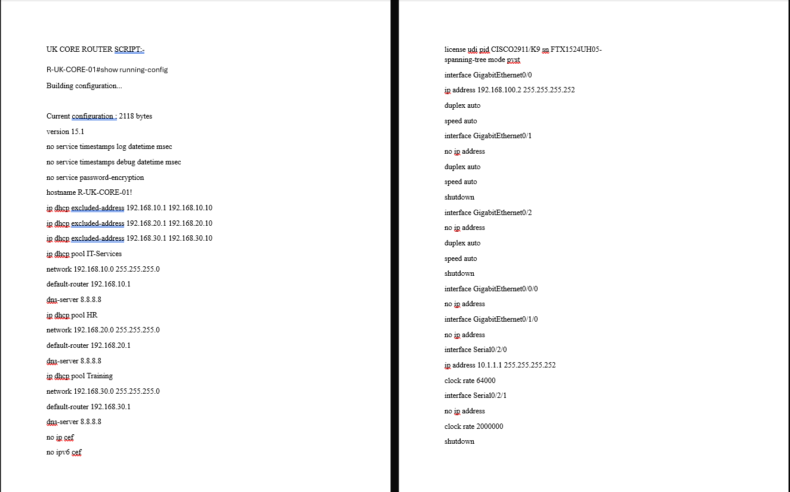
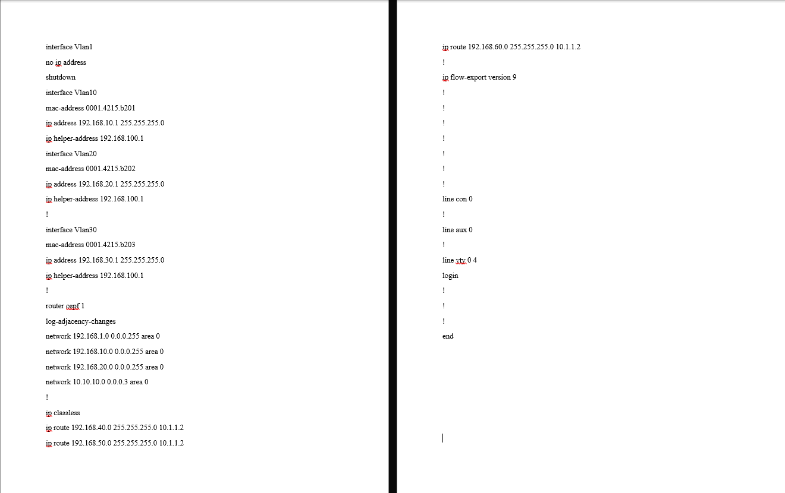
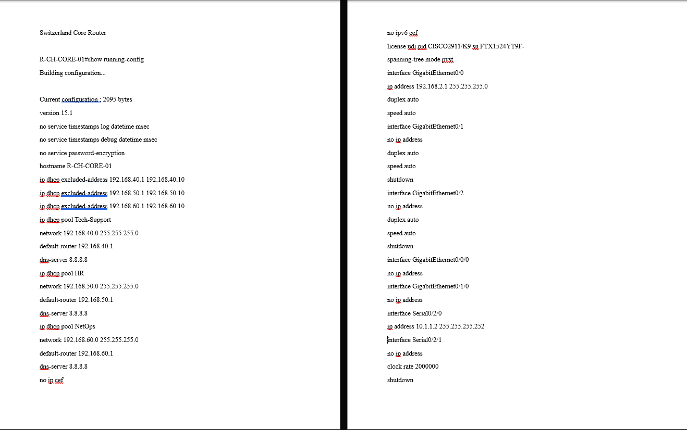
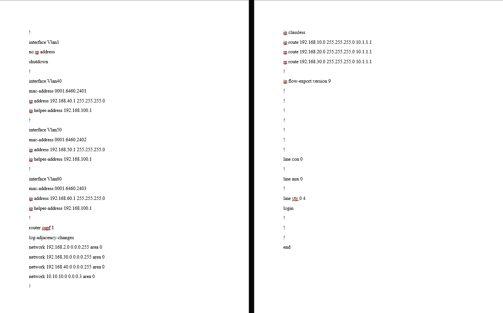

# Enterprise Network Design Evidence

## Overview

This directory contains selected evidence from three related enterprise network-design case studies.

The evidence includes:

- Cisco Packet Tracer network topologies
- Original router configuration captures
- VLAN and routing evidence
- Secure remote-management configuration
- Global multi-site architecture
- Cisco ASA ACL examples
- Site-to-site IPsec VPN configuration

The three case studies were developed independently and use different network scenarios, addressing schemes, devices, and routing approaches.

> The evidence should therefore be interpreted as three related network-engineering case studies rather than one production network.

---

# Evidence Map

| Evidence | Case Study | Demonstrates |
| --- | --- | --- |
| `01-uk-switzerland-enterprise-topology.png` | Case Study 1 | UK/Switzerland multi-site Packet Tracer architecture |
| `02-uk-core-router-config01.png` | Case Study 1 | UK router DHCP, addressing and interface configuration |
| `02-uk-core-router-config02.png` | Case Study 1 | UK VLAN, routing and remote-network configuration |
| `03-switzerland-core-router-config01.png` | Case Study 1 | Switzerland router DHCP and interface configuration |
| `03-switzerland-core-router-config02.png` | Case Study 1 | Switzerland VLAN, OSPF and static routing configuration |
| `04-datacenter-routing-table.png` | Case Study 2 | Data-center routing and connected VLAN networks |
| `05-datacenter-ssh-configuration.png` | Case Study 2 | Secure remote-management implementation evidence |
| `06-global-enterprise-topology.png` | Case Study 3 | HQ and international branch enterprise topology |
| `07-global-security-architecture.png` | Case Study 3 | ASA ACL and site-to-site IPsec VPN configuration |

---

# Case Study 1 — UK & Switzerland Multi-Site Network

## Enterprise Topology


### What This Shows

The Packet Tracer topology represents an enterprise network distributed across:

- United Kingdom
- Switzerland

The design includes:

- Core routers
- Multilayer switching
- Access switching
- Departmental endpoint networks
- WAN connectivity
- Firewall placement
- Internet/cloud connectivity

The architecture demonstrates the transition from individual departmental LANs to an interconnected multi-site enterprise network.

### Design Objectives

The topology was intended to provide:

- Departmental segmentation
- Inter-site communication
- Centralized routing
- Scalable switching
- Security boundaries
- Structured network administration

---

# UK Core Router — Configuration Evidence

## Part 1



This screenshot preserves the first section of the original UK core-router running configuration.

It includes evidence of:

- Router hostname
- DHCP exclusions
- Department-specific DHCP pools
- Default gateways
- DNS configuration
- Interface configuration
- WAN addressing

The preserved configuration identifies the router as:

```text
R-UK-CORE-01
```

Documented DHCP networks include:

```text
192.168.10.0/24 — IT Services
192.168.20.0/24 — HR
192.168.30.0/24 — Training
```

The inter-site serial interface uses:

```text
10.1.1.1/30
```

---

## Part 2



The second screenshot preserves additional configuration including:

- VLAN interfaces
- VLAN gateway addresses
- DHCP relay configuration
- OSPF
- Static routes
- VTY configuration

The VLAN gateways include:

```text
VLAN 10 — 192.168.10.1
VLAN 20 — 192.168.20.1
VLAN 30 — 192.168.30.1
```

Static routes direct traffic toward the Switzerland networks through:

```text
10.1.1.2
```

Examples include:

```text
192.168.40.0/24
192.168.50.0/24
192.168.60.0/24
```

---

# Switzerland Core Router — Configuration Evidence

## Part 1



This screenshot preserves the first section of the Switzerland core-router configuration.

The router is identified as:

```text
R-CH-CORE-01
```

The configuration includes DHCP services for:

```text
192.168.40.0/24 — Technical Support
192.168.50.0/24 — HR
192.168.60.0/24 — Network Operations
```

The WAN-facing serial interface uses:

```text
10.1.1.2/30
```

which corresponds to the UK router's:

```text
10.1.1.1/30
```

interface.

---

## Part 2



The second configuration screenshot includes:

- VLAN 40
- VLAN 50
- VLAN 60
- DHCP relay
- OSPF
- Static routes
- VTY configuration

The documented static routes direct UK departmental traffic toward:

```text
10.1.1.1
```

for networks including:

```text
192.168.10.0/24
192.168.20.0/24
192.168.30.0/24
```

---

# Case Study 1 — Configuration Review

The original router evidence is preserved rather than silently rewritten.

One notable issue is that the WAN interfaces use:

```text
10.1.1.0/30
```

while an OSPF statement in the preserved configuration references:

```text
10.10.10.0 0.0.0.3 area 0
```

This mismatch would require correction in a production implementation.

The repository retains the original evidence because demonstrating the ability to identify configuration problems is more useful than retrospectively presenting an unrealistically perfect implementation.

---

# Case Study 2 — Secure Data Center Redesign

## Routing Table Evidence


### What This Shows

This evidence captures routing information from the redesigned data-center environment.

The routing table demonstrates Layer 3 awareness of multiple segmented networks rather than the original flat Layer 2 architecture.

The redesigned environment included networks for:

```text
VLAN 10 — IT
VLAN 20 — HR
VLAN 30 — Finance
VLAN 40 — Admin
VLAN 50 — Server Zone
VLAN 99 — Management
```

### Why This Matters

A segmented design requires Layer 3 devices to understand how traffic should move between different IP networks.

The routing evidence therefore supports the implementation of:

- Multiple VLAN networks
- Layer 3 interfaces
- Inter-VLAN communication
- Structured subnetting

---

# Data Center Server Architecture

The redesign placed central infrastructure into a dedicated server network.

Documented examples included:

```text
DHCP Server — 192.168.50.10
Web Server  — 192.168.50.20
File Server — 192.168.50.30
```

This allowed access to server resources to be controlled through routing and ACL policy instead of placing servers in the same unrestricted network as user endpoints.

---

# Secure SSH Management Evidence


### What This Shows

This screenshot accompanies the secure remote-management implementation in the data-center redesign.

SSH was introduced to replace insecure plaintext remote administration.

The documented design included:

- Device domain configuration
- RSA key generation
- Local user authentication
- VTY remote-access configuration
- Source restrictions
- IT-VLAN-only administrative access

### Security Objective

The management design follows the principle:

> Network-device administration should be encrypted and restricted to authorized management sources.

Conceptually:

```text
IT VLAN
   │
   │ SSH
   ▼
Router / Multilayer Switch
```

while management attempts from unauthorized VLANs were intended to be blocked.

---

# Data Center ACL Evidence

The original report also preserves an exact ACL example:

```text
access-list 110 deny tcp 192.168.30.0 0.0.0.255 host 192.168.50.20 eq 80
access-list 110 permit ip any any
```

This policy prevents:

```text
Finance VLAN
192.168.30.0/24
```

from accessing:

```text
Web Server
192.168.50.20
```

over:

```text
TCP/80
HTTP
```

while permitting other IP traffic through the following rule.

This demonstrates policy-based inter-VLAN filtering.

---

# Data Center Validation

The original project documents testing of:

- Gateway connectivity
- Approved inter-VLAN communication
- ACL restrictions
- DHCP address assignment
- Firewall/NAT behavior
- SSH restrictions

The report specifically describes testing whether Finance hosts were prevented from accessing the Web Server while retaining permitted access to the File Server.

The evidence therefore includes both configuration intent and documented validation methodology.

---

# Case Study 3 — Global Secure Enterprise Network

## Global Enterprise Topology


### What This Shows

This is the strongest architectural evidence in the repository.

The Packet Tracer topology connects:

```text
Cheltenham HQ
San Francisco
Dubai
Vancouver
```

The diagram visibly includes:

- Branch routers
- Cisco ASA firewalls
- Layer 3 switching
- Access switching
- Servers
- End-user systems
- WAN connections
- External connectivity

Conceptually:

```text
                    Internet
                       │
                       ▼
                 Cheltenham HQ
                  /     |     \
                 /      |      \
                /       |       \
     San Francisco    Dubai    Vancouver
```

---

# Layered Branch Architecture

Each major location follows a similar security-oriented pattern:

```text
WAN / External Network
          │
          ▼
        Router
          │
          ▼
     ASA Firewall
          │
          ▼
  Multilayer Switch
          │
     ┌────┼────┐
     ▼    ▼    ▼
   Users Servers Access
```

This creates multiple control points between external connectivity and internal endpoints.

---

# Departmental Segmentation

The global design uses departmental VLANs including:

```text
VLAN 10 — Admin
VLAN 20 — Sales
VLAN 30 — HR
VLAN 40 — DMZ
```

Dedicated VLANs create logical boundaries for:

- Employees
- Departments
- Public services
- Security policy

---

# DMZ Architecture

The design uses VLAN 40 as a DMZ for public-facing services.

Conceptually:

```text
                   Internet
                      │
                      ▼
                   Firewall
                  /        \
                 /          \
                ▼            ▼
              DMZ          Private
           VLAN 40       VLANs 10-30
              │
       Public Services
```

The objective is to avoid placing externally reachable services directly inside unrestricted employee networks.

---

# Global Security Configuration


### What This Shows

This screenshot preserves original configuration examples relating to:

- HQ ASA ACLs
- Branch ASA ACLs
- Site-to-site IPsec
- ISAKMP policy
- AES encryption
- SHA hashing
- Pre-shared authentication
- IPsec transform sets
- Crypto maps
- VPN traffic-selection ACLs

---

# ASA ACL Example

The preserved evidence includes examples such as:

```text
access-list OUTSIDE_IN extended permit tcp any host 192.168.40.10 eq 80
```

and:

```text
access-list OUTSIDE_IN extended permit tcp any host 192.168.40.11 eq 443
```

These represent explicitly permitted traffic toward selected DMZ services.

---

# Site-to-Site VPN Evidence

The original project documents an HQ-to-San Francisco IPsec configuration.

The architecture includes:

```text
crypto isakmp policy
AES encryption
SHA hashing
pre-shared authentication
IPsec transform set
crypto map
peer configuration
interesting-traffic ACL
```

Conceptually:

```text
San Francisco ───── IPsec ─────┐
                               │
Dubai ───────────── IPsec ─────┼── Cheltenham HQ
                               │
Vancouver ───────── IPsec ─────┘
```

The same overall VPN design was intended for the additional branches.

---

# Credential Handling Note

The original academic screenshot contains a simple plaintext lab pre-shared key used for the Packet Tracer VPN example.

It is preserved in the screenshot because the image represents original historical project evidence.

However:

> The reusable text configuration stored in this repository intentionally replaces the lab credential with `<REDACTED_LAB_PSK>`.

No production credentials or reusable secrets are intentionally published through the configuration files.

A production VPN should use appropriately generated credentials or certificate-based authentication and secure secret-management practices.

---

# Evidence vs. Production Practice

Several configurations shown in these screenshots reflect an academic Cisco lab environment.

Examples include:

- Simple lab credentials
- Legacy cryptographic parameters
- Simplified routing
- Limited redundancy
- Packet Tracer device constraints

These should not automatically be interpreted as recommended configurations for a modern production network.

The purpose of preserving them is to demonstrate:

1. Original implementation work
2. Cisco configuration experience
3. Network architecture knowledge
4. Security-control implementation
5. Ability to critically review earlier designs

---

# Evidence Integrity

This repository deliberately distinguishes between:

## Original Evidence

Material preserved from the original network-design projects.

Examples:

- Packet Tracer topologies
- Router configuration captures
- Routing-table evidence
- SSH configuration evidence
- ASA ACL examples
- VPN configuration examples

## Portfolio Documentation

Technical explanation added to make the original work easier to review.

## Improvement Recommendations

Modernisation opportunities identified after reviewing the original projects.

The repository does not silently rewrite historical evidence to make the original implementations appear more complete than they were.

---

# Evidence Summary

| Area | Evidence |
| --- | --- |
| Multi-site architecture | UK ↔ Switzerland topology |
| DHCP | UK and Switzerland router configurations |
| VLAN gateways | Router configuration captures |
| Static routing | UK and Switzerland configurations |
| OSPF | Original router configurations |
| Data-center routing | Routing-table screenshot |
| Secure management | SSH configuration screenshot |
| ACLs | Original documented ACL commands |
| Global architecture | HQ + three-branch topology |
| ASA firewalling | Original ASA ACL examples |
| DMZ | Global architecture and VLAN design |
| IPsec | Original site-to-site VPN configuration |

---

# What the Evidence Supports

The preserved material supports practical experience with:

- Cisco Packet Tracer
- Cisco IOS
- IPv4 subnetting
- VLAN segmentation
- DHCP
- Inter-VLAN routing
- Static routing
- OSPF
- ACLs
- Cisco ASA
- NAT/PAT concepts
- SSH
- DMZ design
- Site-to-site IPsec
- Enterprise network architecture
- Multi-site network design
- Network-security policy

---

# What the Evidence Does Not Establish

The evidence should not be interpreted as proof of:

- Production deployment
- Enterprise-scale traffic benchmarking
- Real-world ISP connectivity
- Production firewall hardening
- High-availability firewall clustering
- Production VPN cryptographic compliance
- Formal penetration testing
- Production network monitoring
- Zero-downtime failover
- Operational SLA achievement

The projects are Cisco lab and network-design case studies intended to demonstrate networking and security engineering skills.

---

## Related Documentation

- [Enterprise Network Case Studies](../case-studies/README.md)
- [Addressing & VLAN Design](../docs/addressing-and-vlans.md)
- [Routing & Network Security](../docs/routing-and-security.md)
- [UK Core Router Configuration](../configs/case-study-01/uk-core-router-original.cfg)
- [Switzerland Core Router Configuration](../configs/case-study-01/switzerland-core-router-original.cfg)
- [Data Center Security Controls](../configs/case-study-02/security-controls-original.txt)
- [Global Security & VPN Configuration](../configs/case-study-03/global-security-and-vpn-config.txt)
